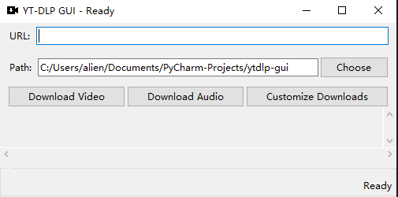
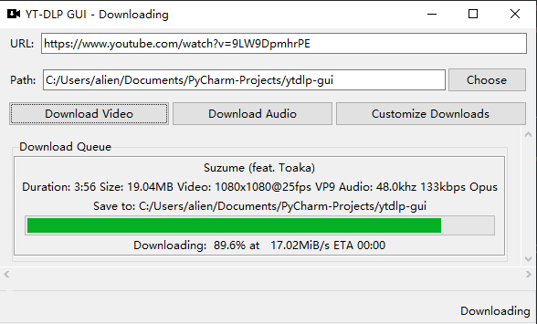
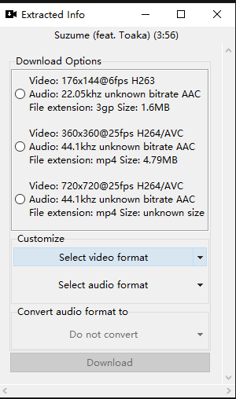

# YT-DLP GUI

This is (yet another) yt-dlp GUI built with pure Python and Tkinter. It is still in early development stage so only basic functions are developed and functional.

## Installation
For Windows, download the executable files from the [releases page](https://github.com/aliencaocao/ytdlp-gui/releases/latest).

For macOS and Linux, you can clone this repository and run the `main.py` file with Python 3, or follow the build instructions below to build binary executables.

## Features
* Downloading videos from all sources that yt-dlp supports into your designated folder.
* Choose and combine any video and audio formats into a single file, or download only video or only audio.
* Built-in transcoding of audio into other formats (AAC, ALAC, FLAC, M4A, MP3, Opus, Vorbis, WAV) for ease of use on other platforms.
* Packaged into a single executable and embeds ffmpeg and ffprobe binaries so user do not have to install anything.
* Cross-platform (Windows, Linux, macOS) and works on both X86 and ARM machines. However, only Windows binary builds are available now, for other formats, you can build yourself from source following the insturctions below.

Home page of the program: "Download Video" and "Download Audio" will download the best quality available for video and/or audio.

Each time you add a download task, it will be added to the queue shown on the home page, with basic details, progress bar and download status.

Download details page of the program (accessible by clicking "Customize Downloads"). You can choose formats with both video and audio streams in Download Options, or choose and combine any available format you like below. If you only choose an Audio format, you can choose to convert the audio into another format.

## Planned features
* Remembering last save location (currently it always defaults to the current working directory).

## Building
You need Python 3.6+.
1. Clone this repository.
2. Install the dependencies with `pip install -r requirements.txt`. On Windows machines, a working ffmpeg.exe and ffprobe.exe is also needed in the same directory as the `main.py` file. You can download them from [here](https://github.com/yt-dlp/FFmpeg-Builds/releases/tag/latest). Choose `ffmpeg-master-latest-win64-gpl.zip`.
3. Modify `version.yml` if needed and run commands in build.txt. On non-Windows machines, remove `--add-data "ffmpeg.exe;." --add-data "ffprobe.exe;."` from it.